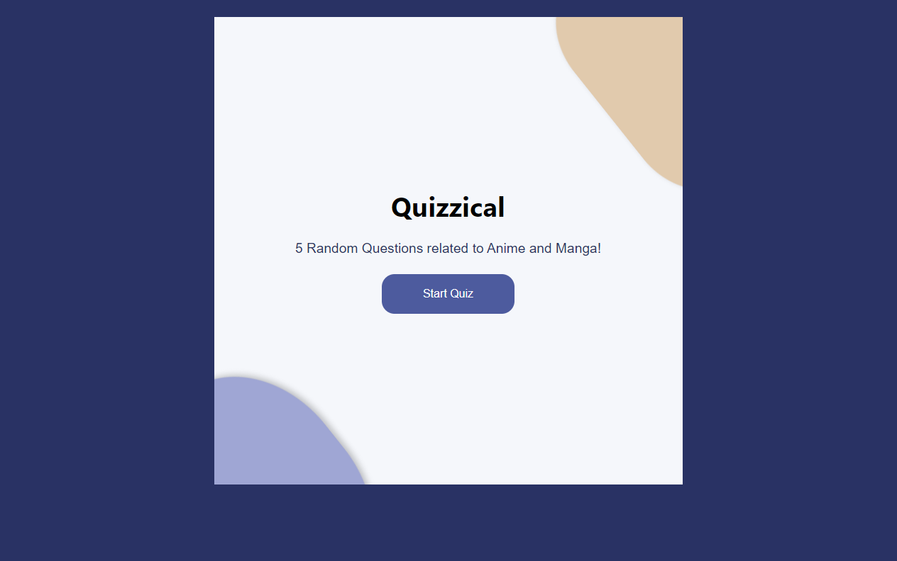
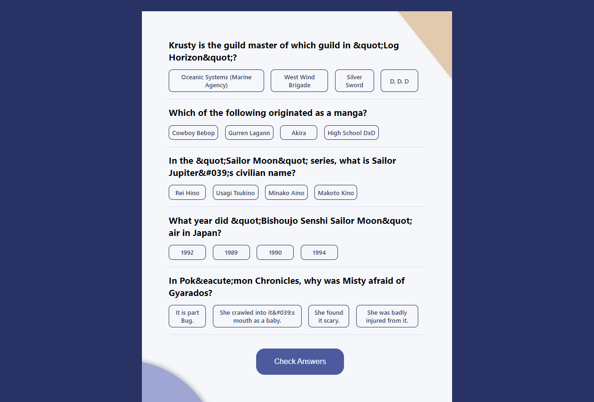
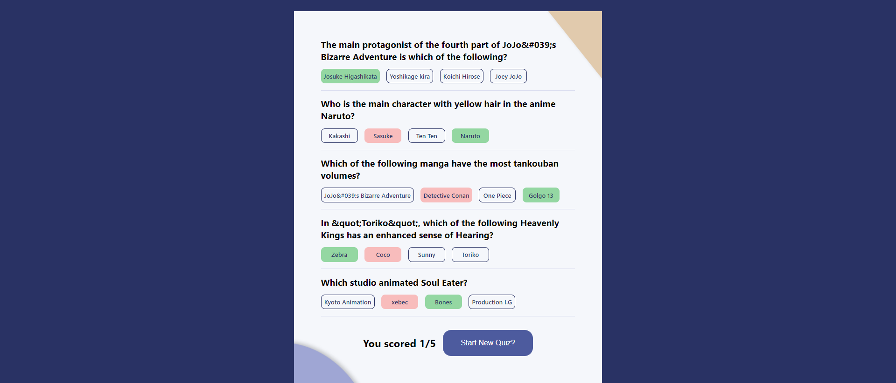

# Quizicca application, 
## 5 random questions from Open Trivia Database api

## Features
- Two screens (Start & Questions)
- Pull 5 questions from OTDB
- Tally correct answers after answer is clicked
- Start A new Quiz

## Screenshots
- Start Screen

- Questions Screen

- Check Answers Screen
